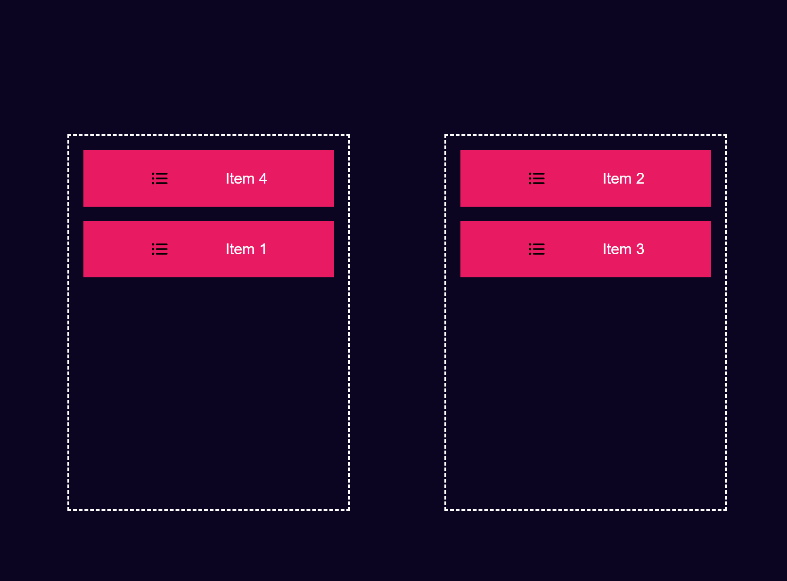

# Drag and Drop Project

This project demonstrates a simple drag-and-drop functionality using HTML, CSS, and JavaScript. Users can drag items from one container and drop them into another.

## Features
- Drag items from the left container.
- Drop items into the right container.
- Fully responsive design.

## Technologies Used
- HTML
- CSS
- JavaScript

## Screenshot

